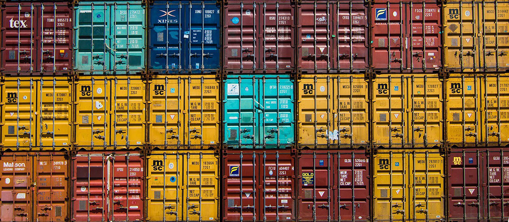
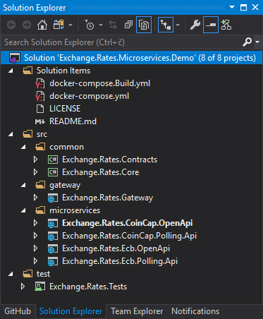
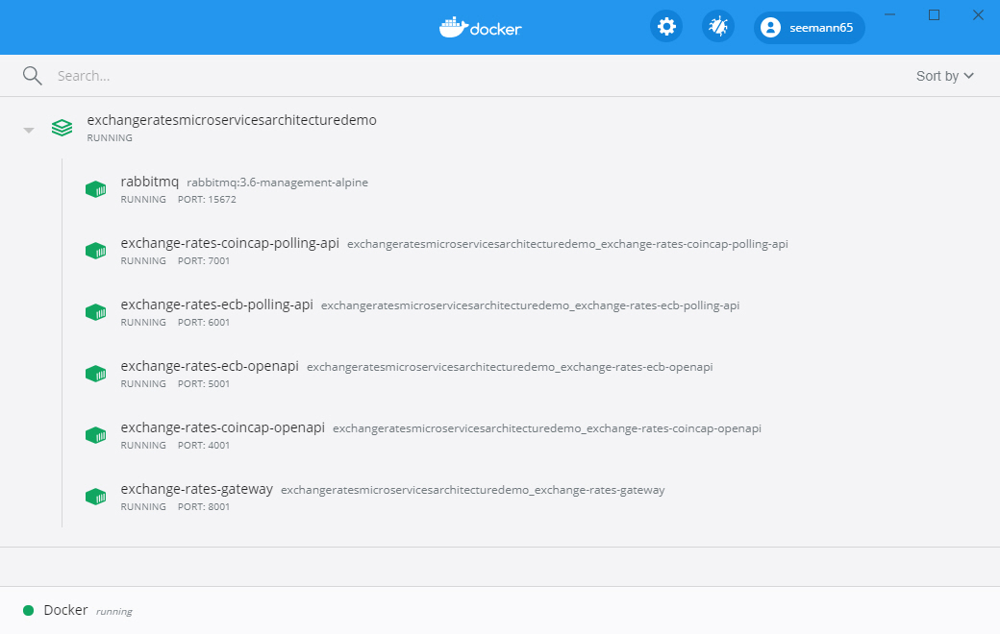
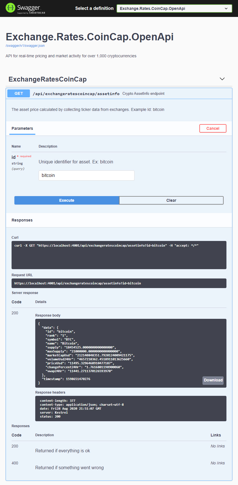
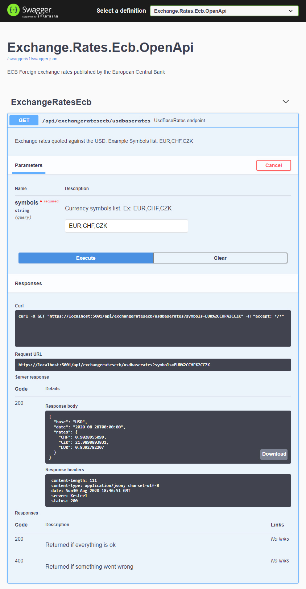
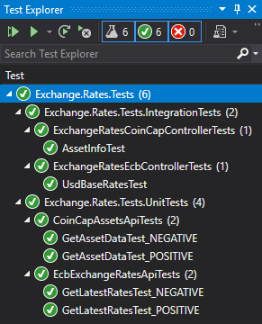

# Microservice Architecture in ASP.NET Core

This demo shows a working sample of microservices architecture using ASP.NET Core. It covers how to create microservices using ASP.NET Core, how to create API gateways using [Ocelot](https://github.com/ThreeMammals/Ocelot), how to use [MassTransit](http://masstransit-project.com) as the service bus, [RabbitMQ](https://www.rabbitmq.com) as the transport running on [Docker](https://www.docker.com/resources/what-container), how to unit test microservices using xUnit, how to monitor microservices using health checks, and finally how to deploy microservices using Docker containers on Linux distributions.

## Introduction

A microservices architecture consists of a collection of small, independent, and loosely coupled services. Each service is self-contained, implements a single business capability, is responsible for persisting its own data, is a separate codebase, and can be deployed independently. Microservices do not know about each other and the only coupling between them is the standalone contract project that both references.

API gateways are entry points for clients. Instead of calling services directly, clients call the API gateway, which forwards the call to the appropriate services.

## Advantages

* Services are easy and self-deployable
* Services are easy to change and test
* Services can be deployed in multiple servers to enhance performance
* Failure in one service does not impact other services
* It's easier to manage bug fixes and feature releases
* Developers can better understand the functionality of a service

## Why MassTransit?
[MassTransit](http://masstransit-project.com) is a free, open source, lightweight message bus for creating distributed applications using the .NET framework. [MassTransit](http://masstransit-project.com) provides an extensive set of features on top existing message transports, resulting in a developer friendly way to asynchronously connect services using message-based conversation patterns. Message-based communication is a reliable and scalable way to implement a service oriented architecture.
If you want to know more please visit [MassTransit](http://masstransit-project.com).

## Why RabbitMQ?
[RabbitMQ](https://www.rabbitmq.com) describes itself as the most widely deployed open-source message broker. It is easy to implement and supports a wide variety of technologies like Docker, .Net or Go. It also offers plugins for monitoring, managing or authentication. I've chose [RabbitMQ](https://www.rabbitmq.com) because it is well known, quickly implemented and especially can be easily run using Docker.

## Architecture
There are four microservices:

* **Exchange.Rates.CoinCap.OpenApi**: REST for retrieving pricing and market activity for cryptocurrencies
* **Exchange.Rates.CoinCap.Polling.Api**: gets cryptocurrencies info. It uses [CoinCap API 2.0](https://docs.coincap.io/)
* **Exchange.Rates.Ecb.OpenApi**: REST for European Central Bank (ECB) Foreign exchange rates
* **Exchange.Rates.Ecb.Polling.Api**: gets ECB exchange rates. It uses [ECB Foreign exchange rates API](https://exchangeratesapi.io/)

## Implementation
For a sake of simplicity I didn't implement any Identity microservice. I've used a [Docker](https://www.docker.com/resources/what-container), so I didn't pollute my development environment with many things concurrently installed. I also assumed you know how to work using Docker workflow.

Solution folder structure looks like this:  


## Certificate
Creating a Certificate to use ASP.NET Core with **HTTPS** in Docker you can create a certificate with command: **dotnet dev-certs https -ep [Path]-p [Password]**. I've created the certificate with SecretPassword as its password.
After creating the certificate, you only have to share it with your container.  
**NOTE:** You must set a password. Otherwise, Kestrel won’t be able to use the certificate!

## Docker-Compose File
Docker-compose file with setup for all the containers looks like this:
```yml
version: '3'
services:
    rabbitmq:
        container_name: rabbitmq
        hostname: rabbitmq
        image: 'rabbitmq:3.6-management-alpine'
        ports:
            - 5672:5672
            - 15672:15672
        environment:
            - RABBITMQ_DEFAULT_USER=guest
            - RABBITMQ_DEFAULT_PASS=guest
        networks:
            - common_network

    exchange-rates-coincap-polling-api:
        container_name: exchange-rates-coincap-polling-api
        hostname: exchange-rates-coincap-polling-api
        ports:
            - 7000:80
            - 7001:443
        environment:
            - ASPNETCORE_URLS=https://+;http://+
            - Kestrel__Certificates__Default__Path=/app/Infrastructure/Certificate/cert-aspnetcore.pfx
            - Kestrel__Certificates__Default__Password=SecretPassword
        build:
            context: .
            dockerfile: ./Exchange.Rate.CoinCap.Polling.Api/Dockerfile
        restart: on-failure
        networks:
            - common_network
        depends_on:
            - rabbitmq

    exchange-rates-coincap-openapi:
        container_name: exchange-rates-coincap-openapi
        hostname: exchange-rates-coincap-openapi
        ports:
            - 4000:80
            - 4001:443
        environment:
            - ASPNETCORE_URLS=https://+;http://+
            - Kestrel__Certificates__Default__Path=/app/Infrastructure/Certificate/cert-aspnetcore.pfx
            - Kestrel__Certificates__Default__Password=SecretPassword        
        build:
            context: .
            dockerfile: ./Exchange.Rates.CoinCap.OpenApi/Dockerfile  
        restart: on-failure
        networks:
          - common_network
        depends_on:
          - rabbitmq

    exchange-rates-ecb-polling-api:
        container_name: exchange-rates-ecb-polling-api
        hostname: exchange-rates-ecb-polling-api
        ports:
            - 6000:80
            - 6001:443
        environment:
            - ASPNETCORE_URLS=https://+;http://+
            - Kestrel__Certificates__Default__Path=/app/Infrastructure/Certificate/cert-aspnetcore.pfx
            - Kestrel__Certificates__Default__Password=SecretPassword
        build:
            context: .
            dockerfile: ./Exchange.Rate.Ecb.Polling.Api/Dockerfile
        restart: on-failure
        networks:
            - common_network
        depends_on:
            - rabbitmq

    exchange-rates-ecb-openapi:
        container_name: exchange-rates-ecb-openapi
        hostname: exchange-rates-ecb-openapi
        ports:
            - 5000:80
            - 5001:443
        environment:
            - ASPNETCORE_URLS=https://+;http://+
            - Kestrel__Certificates__Default__Path=/app/Infrastructure/Certificate/cert-aspnetcore.pfx
            - Kestrel__Certificates__Default__Password=SecretPassword        
        build:
            context: .
            dockerfile: ./Exchange.Rates.Ecb.OpenApi/Dockerfile  
        restart: on-failure
        networks:
            - common_network
        depends_on:
            - rabbitmq

    exchange-rates-gateway:
        container_name: exchange-rates-gateway
        ports:
            - 8000:80
            - 8001:443
        environment:
            - ASPNETCORE_URLS=https://+;http://+
            - Kestrel__Certificates__Default__Path=/app/Infrastructure/Certificate/cert-aspnetcore.pfx
            - Kestrel__Certificates__Default__Password=SecretPassword
        build:
            context: .
            dockerfile: ./Exchange.Rates.Gateway/Dockerfile
        restart: on-failure
        networks:
            - common_network
        links:
            - exchange-rates-ecb-openapi
            - exchange-rates-coincap-openapi
        depends_on:
            - exchange-rates-ecb-openapi
            - exchange-rates-coincap-openapi

networks:
  common_network: {}
```
**NOTE**: When starting multiple containers with a compose file, a **common_network** is created in **which all containers are using**. Containers can reach each other with the container name.

## Runnig in Docker


## Swagger UI for Exchange.Rates.CoinCap.OpenApi


## Swagger UI for Exchange.Rates.Ecb.OpenApi


## Testing
Test project includes both Unit and integration tests:  


## Conclusion
From today’s DevOps position it is necessary to change applications fast and often. Additionally, microservices should run inside a container and Docker is the defacto standard container. That’s it. Works perfectly!

## Prerequisites
- [Visual Studio](https://www.visualstudio.com/vs/community) 2019 16.4.5 or greater
- [.NET Core SDK 3.1](https://dotnet.microsoft.com/download/dotnet-core/3.1)
- [Docker](https://www.docker.com/resources/what-container)  

## Tags & Technologies
- [ASP.NET Core 3.1](https://docs.microsoft.com/en-us/aspnet/?view=aspnetcore-3.1#pivot=core)
- [Ocelot](https://github.com/ThreeMammals/Ocelot)  
- [MassTransit](http://masstransit-project.com)  
- [RabbitMQ](https://www.rabbitmq.com)  
- [Docker](https://www.docker.com/resources/what-container)  
- [OpenAPI](https://swagger.io/specification/)
- [Serilog](https://serilog.net/)

## Licence
Licenced under [MIT](http://opensource.org/licenses/mit-license.php).
Contact me on [LinkedIn](https://si.linkedin.com/in/matjazbravc).
